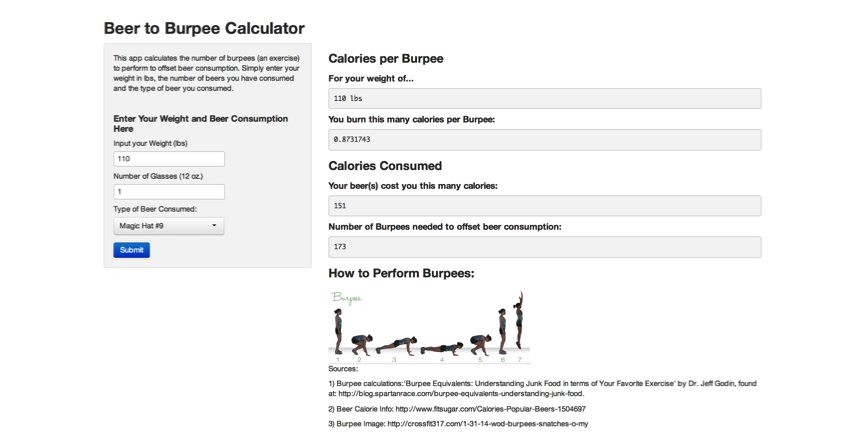

## The Beer to Burpee Calculator App: What it Does

Purpose:  The purpose of this app is to enable a user to calculate how many Burpees
(a type of exercise) one needs to perform to burn calories consumed from drinking beer.

The Beer to Burpee Calculator takes three user inputs...  
1) The user's weight in lbs  
2) Amount of 12 oz glasses of beer consumed  
3) Type of beer consumed  

And returns...  
1) Calories burned per Burpee  
2) Calories consumed, based on number and type of beer  
3) MOST IMPORTANTLY: The number of Burpees needed to offset beer consumption  

The app also includes instruction on proper Burpee form.

--- .class #id 

## Calculating Calories Burned per Burpee  
This calculation is one of several components of the App. The function takes the user's weight and converts it to calories burned per Burpee based on a few assumptions (outlined below).  

Details regarding the derivation of this calculation can be found in the article: 'Burpee Equivalents:  Understanding Junk Food in terms of Your Favorite Exercise' by Dr. Jeff Godin, found at: http://blog.spartanrace.com/burpee-equivalents-understanding-junk-food.

```r
cal <- function(Weight) {
    weight_kg <- (Weight/2.2046)    #Convert user input Weight from lbs to kg
    cal <- weight_kg * 3.5/1000 * 5 #Calculate calories per Burpee: Assumptions
    #     1) Each Burpee consumes 3.5 ml of O2 per kg of weight.
    #     2) 1L of oxygen consumed = 5 kcals
    print(cal)}
# A user weighing 120 lbs would burn this many calories per burpee...
cal(120)
```

```
## [1] 0.9526
```

--- .class #id 

## What the App Looks Like:
 

--- .class #id 

## Why You Should Use the Beer to Burpee Calculator
  
    
    
This App raises awareness of the relationship between beer consumption and the
amount of exercise required to offset beer calories consumed.

Using the calculation shown in the previous slide...

Assuming it takes a fairly fit person 1 minute to perform 12 to 15 Burpees, it would take over 10 minutes
of Burpees to burn the calories consumed in a single beer.


